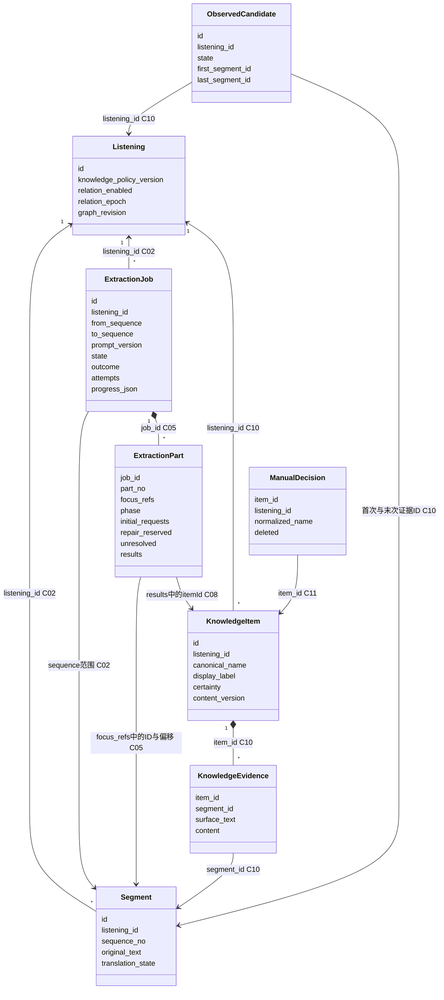
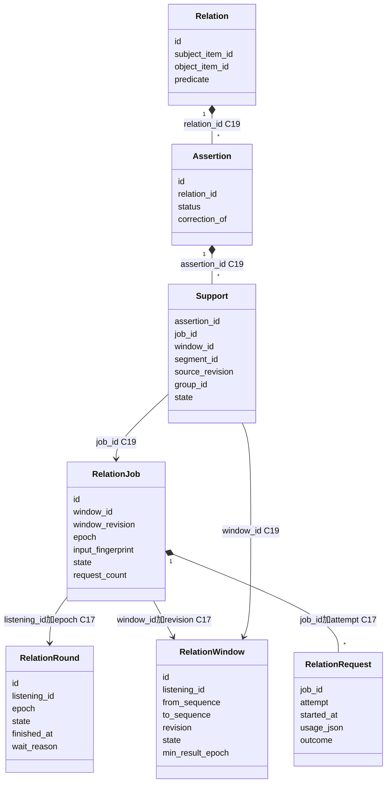
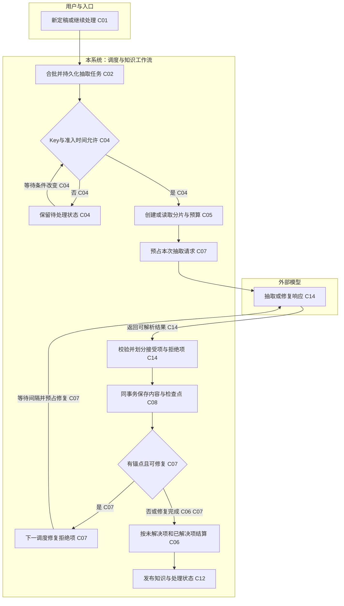
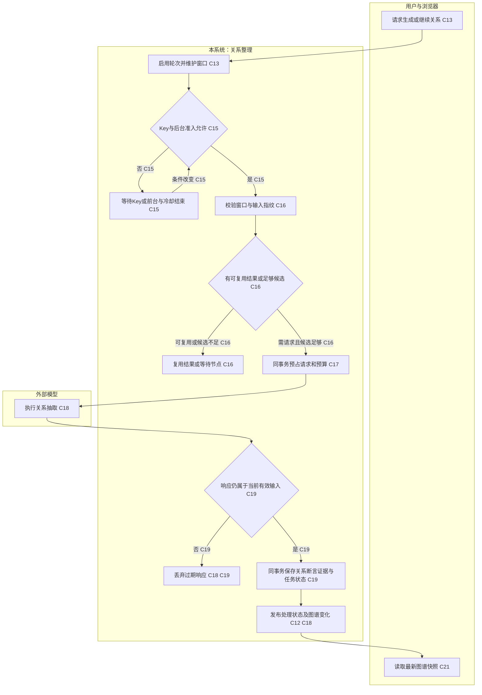
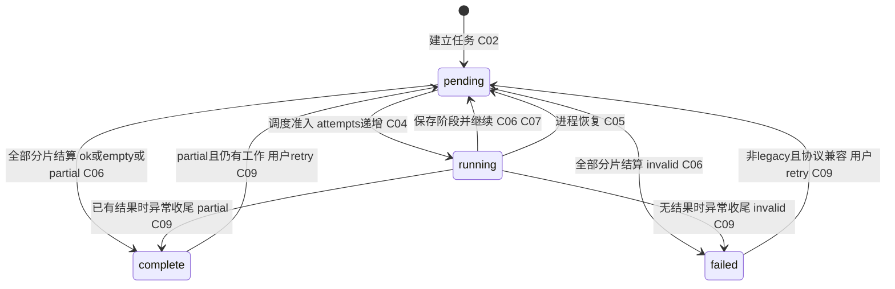
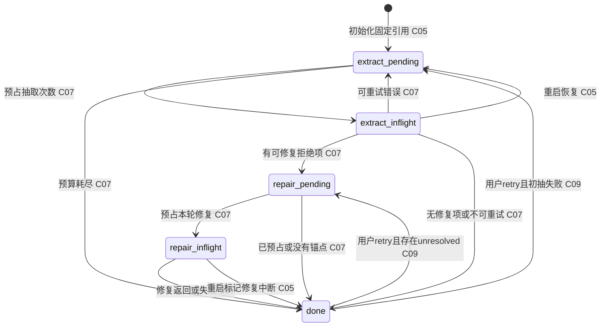
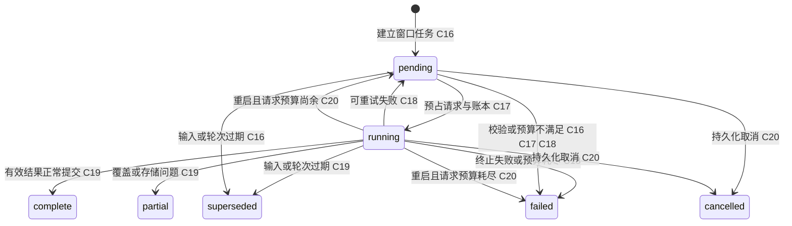

# 知识整理：现状行为模型

> 报告编号：knowledge-organize--20261008T220836Z。生成时间：2026-10-08T22:08:36Z（北京时间 2026-10-09 06:08:36）。保存路径：`docs/behavior-models/knowledge-organize--20261008T220836Z.md`。历史参考：无；本次不进行旧模型对比。

> 范围：**知识整理（v2 抽取、保存、修复，以及已启用的关系整理）**。这是未指定流程时采用的本次范围，不代表全系统模型。入口包括识别定稿后自动排队、`POST /api/listenings/:id/retry`、`POST /api/listenings/:id/graph`，取消入口为 `DELETE /api/listenings/:id/graph`。翻译与播报仅作为调度约束，不展开其内部；人工编辑只分析自动抽取会读取的保护规则。
>
> 代码：`b5119aaefaa11b3feb180b44c606d05209362981`（`main`，拉取确认已最新）。分析开始时跟踪文件无修改，存在未跟踪 `.tmp/`；本次仅新增报告。环境预检通过：Node `24.20.0`，顶层依赖与锁文件一致。未调用业务接口、付费模型或生成演示日志。
>
> 日志：唯一发现的 `.tmp/dev.log` 共 5 行，只含启动信息，无时间戳及 `execution_trace`。运行会话历史无法读取。因此**无法还原实例级流程**，没有可界定的业务观测窗口、运行构建版本或生产路径频次。代码埋点预期 `schema_version=1`、`instrumentation_version=3`，不等于已确认运行时版本。[L01、C22]
>
> 样本：可解析业务追踪事件 0，完整实例 0，业务频次分母不可建立；5 行启动/空白文本不作为业务事件。没有可以去重、排序或分类的业务实例，不能把样本缺失解释为任务从未执行。本文为**代码支持的现状模型**；所有代码路径统一放在“冷路径”附录，表示本次材料未观测，而非证明它们在生产中罕见。

代码中最需要区分的四件事：知识任务的调度尝试不等于模型请求；`continue` 不等于业务完成；知识 `complete` 可携带 `partial` 结果；知识保存不等于关系已生成或浏览器已刷新。[C04、C06、C07、C12、C21]

## 1. 类图

以下图只表达对象与引用关系，不表达执行先后。类名为业务候选名称，属性保留技术名；它们主要是 SQLite 持久化镜像，不表示程序已有同名领域类。实心菱形表示本模型中的从属记录，箭头表示仅通过 ID/范围关联，**不证明领域聚合边界**。[C02、C05、C08、C10、C13、C17、C19]

### 知识抽取与内容对象

`KnowledgeEvidence` 为展示用分组：`knowledge_mentions` 存引用，`knowledge_facts` 存增量事实，两者不是同一张表。别名与更正记录为条目的附属数据，来自 `knowledge_aliases`、`knowledge_revisions`；未另展开为技术类。[C10]

### 关系整理对象

`Relation.subject_item_id/object_item_id` 指向上一图的 `KnowledgeItem`；`Support.segment_id` 指向 `Segment`。窗口跨多个关系，关系也可累积多个窗口证据，不能由图推断“一个窗口拥有一个关系”。[C17、C19]

| 对象 | 性质 | 本流程读写行为 | 证据 |
| --- | --- | --- | --- |
| 收听、句子 | 持久化镜像；上下文对象 | 读取原文范围、策略版本；更新图谱版本与关系启用轮次 | C01、C02、C12、C13 |
| 抽取任务、分片检查点 | 持久化镜像；任务聚合候选 | 固定分片引用、预占请求、保存结果、重试与恢复 | C05–C09 |
| 知识条目及证据 | 持久化镜像；知识条目聚合候选 | 新建、更正、追加事实/别名/引用；不确定身份进入观察候选 | C10 |
| 观察候选、人工决定 | 持久化镜像 | 读取候选；写观察/排除；读取人工保护规则 | C03、C10、C11 |
| 关系轮次、窗口、任务、请求账本 | 持久化镜像；整理轮次/窗口聚合候选 | 维护代次、输入快照、预算、状态和请求用量 | C13–C20 |
| 关系、断言、支持证据 | 持久化镜像；关系聚合候选 | 原子写入关系及可追溯证据；显式更正可替代旧断言 | C19 |

## 2. 活动图

### 主路径

**观测主图缺失。**完整实例为 0，无法选择频次最高的路径，亦不能称某条代码分支为生产“主路径”。代码支持的抽取路径和关系路径分别见附录 A1、A2；没有日志频次标签。[L01]

### 已观测异常或补偿路径

**观测异常图缺失。**没有可关联的失败、重试、恢复、取消或补偿实例。代码异常分支见附录 A3；重试、保留已成功条目、拒绝迟到响应均不能自动称为补偿。[L01、C07–C09、C18、C20]

## 3. 状态图

抽取任务、分片及关系任务具有明确持久化状态；但没有同一对象的源状态、目标状态与日志关联证据，因此本节不画观测状态转移。代码允许的转移使用 `stateDiagram-v2` 单独列于附录 A4。[C05–C09、C17–C20]

| 对象转移 | 次数/分母及计数单位 | 代码证据 | 日志证据 |
| --- | --- | --- | --- |
| 抽取任务与分片 | 不可统计；应按 job_id / part_no / cycle 区分 | C05–C09 | 缺失，L01 |
| 关系任务与请求 | 不可统计；应按 job_id / attempt 区分，并关联 window_id / epoch | C17–C20 | 缺失，L01 |
| 关系断言状态 | 不可统计；须关联 assertion_id 及具体证据变化 | C19 | 缺失，L01 |

必须区分的状态含义：

- 知识任务 `state=complete` 的 `outcome` 可以是 `ok`、`empty` 或 `partial`；`invalid` 对应 `failed`。`resolved_count` 也包含 `observed/excluded/repeated/deferred_identity`，不是可见卡片数。[C06、C10]
- `attempts` 在调度进入 `running` 时递增；分片 `stats.request_count` 才是该代码路径预占的请求次数。等待或下一阶段调度也可能增加尝试次数。[C04–C07]
- 关系任务 `partial` 指实际覆盖受限或存储校验问题；单纯过滤模型候选可以正常 `complete`，也可能一条边都没有。[C19]
- 关系轮次 `finished_at` 有值不保证持久化 `state=complete`：`finishIdleRun` 只填写时间并清空等待原因，保留 `active`。不能把界面汇总状态当作该字段的生命周期。[C23]
- 追踪 span 的 `succeeded` 只是技术执行结果，不能覆盖工作流返回的 `continue/partial/discarded`。[C04、C06、C18、C22]

## 4. 事件风暴时间线

实例：**没有完整实例，无法建立实际时间线或因果顺序**。以下是代码中已存在的命令/通知/诊断事件清单，列举顺序不是执行时间线。[L01]

| 顺序/并行组 | 命令/候选领域事件/技术事件 | 触发者与入口 | 业务动作或事实解释边界 | 涉及对象/外部系统 | 原始技术名 | 证据 |
| --- | --- | --- | --- | --- | --- | --- |
| 未观测 | 命令 | 识别定稿处理 | 新句落库后安排抽取；不说明翻译已完成 | Segment、ExtractionJob | `schedule(listeningId)` | C01 |
| 未观测 | 命令 | 用户 POST retry | 重开失败/部分知识任务并提供内存 Key | ExtractionJob、Part | `retry`、`resumeProcessing` | C01、C09 |
| 未观测 | 技术事件 | 知识执行器 | 为分片预占请求；不代表 HTTP 已发出 | ExtractionPart、外部模型 | `checkpoint_reserved` | C07 |
| 未观测 | 技术事件 | 知识执行器 | 保存接受项与检查点后记录；不证明界面收到通知 | Part、KnowledgeItem | `checkpoint_committed` | C07、C08 |
| 未观测 | 应用通知 | 服务端广播 | 向订阅者发送变化条目 | KnowledgeItem、浏览器 | `knowledge-upserted` | C12、C21 |
| 未观测 | 命令 | 用户 POST graph | 开启/继续关系轮次；202 表示受理，不是全部完成 | RelationRound、Window | `enableRelations` / `retryProblemRelations` | C13 |
| 未观测 | 技术事件 | 关系执行器 | 为本次请求预占并关联源句 | RelationJob、Request、Segment | `checkpoint_reserved`、`source_linked` | C17、C18 |
| 未观测 | 技术事件 | 关系执行器 | 关系提交返回后记录；本次可能无新边 | Relation、Assertion、Support | `checkpoint_committed` | C18、C19 |
| 未观测 | 应用通知/技术事件 | 状态发布 | 通知图谱版本变化；不能证明浏览器渲染成功 | Listening、浏览器 | `graph-invalidated`、`notification_sent` | C12、C18、C21 |
| 未观测 | 命令 | 用户 DELETE graph | 先持久化取消，再中止在途请求 | Round、Job | `cancelRelations`、`relationScheduler.cancel` | C20 |

“知识内容已保存”“关系证据已采纳”可作为候选领域事件名称，但当前证据只确认存储行为和技术诊断，未证明它们是独立的业务契约。[I01]

实例关联约束：[C22]

- `listening_id` 是收听范围，不能代表唯一任务实例；同一收听会产生多个知识/关系任务。
- `job_id` 区分任务；知识需进一步关联持久化 `part_no`、`cycle`，关系需关联持久化 `window_id`、`epoch`、请求 `attempt`。
- `trace_id/span_id/parent_span_id` 表达技术执行归属；`process_id + sequence` 可确定同进程记录顺序，`event_id` 用于识别重复事件。跨进程不能按墙钟强造因果。
- 这些持久化维度不保证全部出现在脱敏 trace 中：属性白名单保留数值 `part_no`、`request_count` 等字段，但未包含 `cycle/window_id/epoch`。执行器传入字段不代表最终日志一定保留它；缺失时必须以已授权、可关联的检查点证据补足，不能猜测。

### 失败后补偿时间线

未观测到补偿实例。自动修复无效模型条目是补充处理；网络重试是再次尝试；事务 `ROLLBACK` 是原子写入失败的回滚；这些都不等于撤销已经完成业务效果的补偿流程。[C07、C08、C18、L01]

## 5. 聚合候选与待确认清单

**以下全部是假说，不是已确认领域设计，也不作为重构建议。**[I02–I05]

| 聚合候选 | 内部对象 | 推测的不变量 | 证据强弱与反证 | 待确认业务问题 |
| --- | --- | --- | --- | --- |
| 知识抽取任务 [I02] | Job、Parts、预算及结果索引 | 已处理 sourceIndex 不重复应用；接受项与检查点一致提交 | 同一 `saveKnowledgeCheckpoint` 事务为强证据；但事务同时改多个知识条目并触发图谱窗口变化，任务不一定拥有内容对象 [C08、C12] | 用户理解的“整理完成”是本轮结束、所有候选解决，还是有新卡片？ |
| 知识条目 [I03] | 条目、别名、引用、事实、更正记录；人工规则为可能的边界对象 | 自动抽取不能覆盖人工决定；同名不自动视为同一实体 | 同事务写入及人工保护为强证据；条目跨任务、跨窗口复用，来源句子仅以 ID 引用 [C10、C11] | 人工决定的优先级是否适用于所有角色和后续收听片段？排除是本记录内还是跨记录语义？ |
| 关系整理轮次/窗口 [I04] | Round、Window、Job、Request；二者是否同一聚合待确认 | 取消或过期轮次不得接纳迟到结果；同窗口同 epoch 请求预算受限 | 预占和取消事务为强证据；窗口可跨轮次复用，多个窗口存在更正顺序屏障，不能仅由同 listening_id 判为同一聚合 [C16、C17、C20] | 用户“继续整理”表示续做还是开始一个新业务轮次？部分窗口完成是否可单独验收？ |
| 关系及断言证据 [I05] | Relation、Assertion、Support、Revision | 关系端点须有效，支持证据须对应当前原文；显式更正需有来源依据 | 关系提交事务与存储校验为强证据；证据关联任务、窗口、句子，事务范围并非领域所有权证明 [C19] | `needs_review` 由谁确认？否定、条件和归属不同的断言何时视作业务冲突？ |

## 附录：证据账本与名称对照

所有 C 证据固定在 commit `b5119aaefaa11b3feb180b44c606d05209362981`。路径相对仓库根目录；行号用于定位该 commit，而非保证未来版本同号。精确片段仅摘录必要代码。C 证据类别均为“代码已核对、本次未观测（冷路径）”；L01 是日志完整性证据，不是业务实例。

| ID | 候选业务名 → 原始技术名 | 来源与精确定位/片段 | 关联字段 | 类别 |
| --- | --- | --- | --- | --- |
| C01 | 触发整理 → `schedule/resumeProcessing` | `server.mjs:879–887,901–905`：定稿新插入后 `knowledgeScheduler.schedule(listeningId)`；`430–443,684–691`：`store.retry(...); resumeProcessing(...)` | listening_id、segment_id、job_id | 冷路径 |
| C02 | 合批建任务 → `extractionRange/createExtractionJob` | `knowledge-queue.mjs:3–6,36–59`；`storage.mjs:328–360`：`LIMIT 3`、相邻未尝试任务合并、`policyVersion` | listening_id、from/to_sequence | 冷路径 |
| C03 | 组装原文与候选 → `jobInput` | `storage.mjs:533–572`：前 3 句上下文；v2 现有候选最多 12、观察候选最多 8；`knowledge.mjs:294–305` 分片 | segment_id、existing/observed_item ID | 冷路径 |
| C04 | 准入与继续 → `pump/perform` | `knowledge-queue.mjs:76–117,120–163`：`busy ? 1 : config.concurrency`、`result.kind === 'continue'`；`server.mjs:93–100` 配置 | listening_id、job_id、attempt | 冷路径 |
| C05 | 分片引用与恢复 → `partsFor/initializeKnowledgeParts/recoverKnowledgeCheckpoints` | `knowledge-workflow.mjs:12–35,153–179`；`storage.mjs:12–20,432–451,488–505`：`focus_refs: previous.focus_refs` 另见 C08 | job_id、part_no、segment_id | 冷路径 |
| C06 | 结算任务 → `knowledgeResultSummary/settle` | `knowledge-workflow.mjs:73–99,117–142`：`unresolved ? (summary.resolved_count ? 'partial' : 'invalid') : ...` | job_id、cycle | 冷路径 |
| C07 | 请求、修复、错误预算 → `execute` | `knowledge-workflow.mjs:181–239,243–286`：`MAX_EXTRA_REQUESTS=2`（第 5 行）、`repair_reserved: 1`；`knowledge-queue.mjs:8–15` 错误分类 | job_id、part_no、request_count | 冷路径 |
| C08 | 接受项与检查点原子保存 → `saveKnowledgeCheckpoint` | `storage.mjs:23–26,454–486`：`BEGIN IMMEDIATE`；`if (applied.has(entry.sourceIndex)) continue` | job_id、part_no、sourceIndex、itemId | 冷路径 |
| C09 | 人工继续未解决项 → `retry/markJob` | `storage.mjs:378–395,736–764`：`cycle: (checkpoint.progress.cycle || 1) + 1`，保留既有 results | listening_id、job_id、cycle | 冷路径 |
| C10 | 合并知识内容 → `applyKnowledgeV2WithinTransaction` | `storage.mjs:318–326,631–734`：`deferred_identity`；写候选、条目、别名、引用、事实和更正 | item_id、segment_id、candidate id | 冷路径 |
| C11 | 人工内容保护 → `manualKnowledgeDecision` | `knowledge-edit.mjs:84–96`：保留真实新引用；`storage.mjs:651–655`：`visibleChange: false` | listening_id、item_id | 冷路径 |
| C12 | 发布变化、标记窗口变化 → `publishProcessing/relation_node_*` | `server.mjs:77–90,225–235`；`relation-storage.mjs:190–220`：`graph_revision=graph_revision+1` 与有条件 `dirty(...)` | listening_id、graph_revision、window id | 冷路径 |
| C13 | 启用关系 → `enableRelations/retryProblemRelations` | `server.mjs:708–731`；`relation-storage.mjs:403–448`：`expectedEpoch`、`relation_epoch + 1`、每 6 句窗口 | listening_id、epoch、window_id | 冷路径 |
| C14 | 校验模型知识输出 → `validateV2Item/parseKnowledgeV2` | `knowledge.mjs:154–245,335–392`：`create/update/repeat/observe/exclude`；`qwen3.8-flash`（第 308 行） | sourceIndex、segment_id、候选ID | 冷路径 |
| C15 | 关系后台准入 → `relationScheduler.pump` | `relation-queue.mjs:4,90–165`；`server.mjs:105–109`：前台忙、Key、冷却及最多 2 个并发 | listening_id、job_id | 冷路径 |
| C16 | 选择窗口/复用结果 → `nextRelationJob/inputFor` | `relation-storage.mjs:268–310,530–595`：`input_fingerprint`、更正屏障、`waiting_nodes`、复用历史结果 | window_id、revision、epoch | 冷路径 |
| C17 | 预占关系请求 → `beginRelationRequest` | `relation-storage.mjs:598–627`：`windowCount >= 3`；`INSERT INTO relation_requests` | job_id、attempt、window_id、epoch | 冷路径 |
| C18 | 调用、重试和过期响应 → `relationWorkflow.execute` | `relation-workflow.mjs:4–14,28–123`：`requestFinished ? null : relationRetryDelay(...)`、`result?.stale` | job_id、attempt、segment_id | 冷路径 |
| C19 | 提交关系与证据 → `validateEntry/commitRelationJob` | `relation-storage.mjs:350–386,650–732`：检查 round/epoch/fingerprint；`state = ... ? 'partial' : 'complete'` | relation/assertion/support id、job_id | 冷路径 |
| C20 | 取消/进程恢复 → `cancelRelations/recoverRelationJobs` | `server.mjs:698–706`；`relation-storage.mjs:37–43,390–401,450–454`；`relation-queue.mjs:173–176` | listening_id、epoch、job_id | 冷路径 |
| C21 | 接收变化并重读 → 浏览器通知与 graph loader | `public/app.js:1494–1515`；`public/knowledge-graph.js:349–374,581–616`：`void loader.refresh()`，不重复 POST/DELETE | listeningId、graphRevision | 冷路径 |
| C22 | 追踪关联与完整性 → `TraceEvent/TaskMetadata/snapshot` | `src/shared/diagnostics.ts:17–45`；`src/server/runtime/diagnostics.ts:5–14,30–42,75–81`；`server.mjs:54–59`；`scripts/build.mjs:16–25` | event_id、process_id、sequence、trace/span ID | 冷路径 |
| C23 | 轮次空闲收尾 → `finishIdleRun` | `relation-storage.mjs:34–35`：只更新 `finished_at/wait_reason/next_ready_at`，未将 state 改为 complete | listening_id、round id | 冷路径 |
| C24 | 同名技术步骤的旁路 → `knowledge.execute` | `server.mjs:313–314,458–459,637–638`：配置检测及人工卡片生成入口 | kind、job_id、listening_id | 代码支持的旁路，未观测 |
| L01 | 日志材料核验 | `.tmp/dev.log:1–5`；检查全部 5 行及匹配 `^execution_trace `，匹配 0；缺少时间戳，不能归入业务观测窗口；旧执行会话无法读取 | 无业务关联字段 | 证据缺口 |
| I01 | 候选领域事件 | 根据 C07/C08/C18/C19 推测保存、采纳的业务称谓，未确认事件契约 | 待确认 | 推断 |
| I02–I05 | 聚合候选 | 根据第 5 节所列事务、ID 引用与反证提出的假说 | 见第 5 节 | 推断 |

## 附录：冷路径

**所有下图均为代码允许的路径，不是实际观测图；没有频次、时延或成功率结论。**

### A1. 知识抽取与保存（代码活动图）

该图概括一个分片循环，剩余分片通过 `settle` 返回 `continue` 再次调度。模型异常另见 A3；图中的通知节点不表示之前没有增量通知：每次 `save` 都可发布进度，存在变化条目时立即广播。[C06–C08、C12]

合批默认：静默 1.5 秒、首句最大等待 4 秒；达到 3 句、累计 1200 字符或 force 会刷出缓冲。单次选句最多 3 句，通常受 2500 字符约束，单个超长句可进入后续分片；未开始且相邻任务可合并至最多 6 句、2500 字符。实际调度并发默认 2，翻译忙时为 1。[C02、C03、C04]

知识输入基于**原文**。翻译与知识的触发来自同一新定稿分支，但代码不是“等待翻译完成才抽取”；翻译忙是知识的限流/宽限约束。关系整理另受前台优先限制。[C01、C03、C04、C15]

### A2. 关系整理（代码活动图）

关系未启用时，不因知识条目保存而自动等价为用户已启动关系生成。启用后，知识身份、引用、别名、原文等变化会按触发器规则使相关窗口重新检查；只变卡片简介不等价于需要重新付费生成关系。图谱版本变化也不等于一定有新边。[C12、C13、C16]

更正窗口有顺序屏障：必须看到此前窗口的结果，后续窗口不能越过；其他合格窗口允许有限并发。一次调度最多执行一次模型请求，关系同窗口同 epoch 最多 3 次预占，重启不清零。[C15–C18、C20]

### A3. 失败、恢复、取消（代码分支，不是观测补偿）

| 触发条件 | 代码允许的处理 | 保留/边界 | 证据 |
| --- | --- | --- | --- |
| 知识初次抽取瞬时失败 | 有预算时回到 extract_pending，按退避与冷却再调度 | 任务级额外抽取请求上限 2；协议重试上限 1 | C07 |
| 部分输出无效且有锚点 | 接受项先保存，下一次只修复有锚点的拒绝项 | 每分片本轮 repair_reserved 只预占一次；不重新输出成功项 | C07、C08、C14 |
| 修复请求失败 | 分片 done，保留 unresolved 与修复错误，再结算 partial/invalid | 不自动重复同一分片修复请求；用户 retry 可开启下一 cycle | C06、C07、C09 |
| 400/401/403/404/422 配置类错误 | 停止剩余未完成分片并结算 | 不无条件循环请求 | C07 |
| 请求返回后的存储/诊断问题 | 已返回请求不进入网络重试；由外层标记任务结果 | 不能将“模型成功”写成“内容成功保存” | C04、C07 |
| 知识进程中断 | extract_inflight 回到 extract_pending；repair_inflight 变 done 并附 REPAIR_INTERRUPTED | 保留请求预算及已接受结果，原 running Job 重置 pending | C05 |
| 关系输入在途变化或旧 epoch 返回 | 依据当前轮次与 fingerprint 拒收，旧任务可 superseded | 无效结果不能覆盖当前图谱；不把所有 revision 变化都当内容变化 | C16–C19 |
| 用户取消关系 | 先写取消状态和保护条件，再 abort 网络 | 已成功结果保留；取消不等于撤销历史关系 | C20 |
| 关系请求瞬时/协议失败 | 预算允许时安排重试；请求已返回后的提交失败不重放模型调用 | 请求账本不因重启清零；401/403 会阻止同 Key 继续准入 | C17、C18、C20 |
| 关系操作 HTTP 响应丢失 | 浏览器重新 GET 对齐服务端状态 | 不自动重复 POST/DELETE；不把客户端超时当任务未执行 | C21 |

### A4. 代码状态图（均无观测次数）

#### 抽取任务：持久化 state 与 outcome 分开

图保留 `pending → complete/failed`，因为多数分片响应先保存为 `pending`，再由 `settle` 结算；不能仅按直觉画成一次 `running → complete`。这是精简图，`settle` 也可在读取到全部分片已完成后直接结算，源 Job state 取决于调用上下文。[C06–C09]

#### 抽取分片：工作阶段

`done` 只表示分片本轮不再自动推进，不保证拒绝项清零；配置失败还可把所有未完成分片直接置为 `done`。[C06、C07]

#### 关系任务：正常、重试与取消边界

这是当前正常调用约束下的子图，不把存储方法允许的所有旁路调用补为运行事实。`commitRelationJob` 的保护条件也允许有效的 pending Job 提交；现行工作流正常先预占 running，再调用提交。[C17–C19]

## 附录：历史或旁路

- 旧协议 `prompt_version != 2` 的抽取仍走 `server.mjs:404–417` 的分批 `applyKnowledge` 路径，并由调度器把 `undefined` 返回标为 complete；不与 v2 检查点流程合并。[C04，代码片段见上述文件/行号，commit 同本报告]
- 人工卡片生成、配置检测等也能使用 `knowledge.execute` 技术步骤，但不一定属于本报告选定的抽取 Job。应结合入口、`kind`、持久化 job_id 判断，不能只靠同名 step 归类。定位：`server.mjs:313–314,458–459,637–638`。[C24]
- 没有可识别的历史业务日志，无法确认上述旁路是否实际执行，也无法对齐任何旧构建。[L01]

本文不对旧模型作差异结论，也不把近期 Cytoscape 渲染改动当成后台业务边界变化。

## 附录：交付核对

- 报告独立新建，使用排他创建；未覆盖历史文件。
- 固定五部分齐全；观测主/异常活动图、观测状态图和正常/补偿时间线均说明缺少实例证据，代码图单列附录。
- 本次无日志样本、无生产频次估计、无付费调用、无代码修改、无重构建议。
- Mermaid 提供源码；未做图片渲染验证。已核对图块边界、证据引用与源文件定位。
- 后续如果补充日志，应另建报告并记录真实窗口与构建版本；不能追溯性地把本文代码图改称“当时已观测”。
