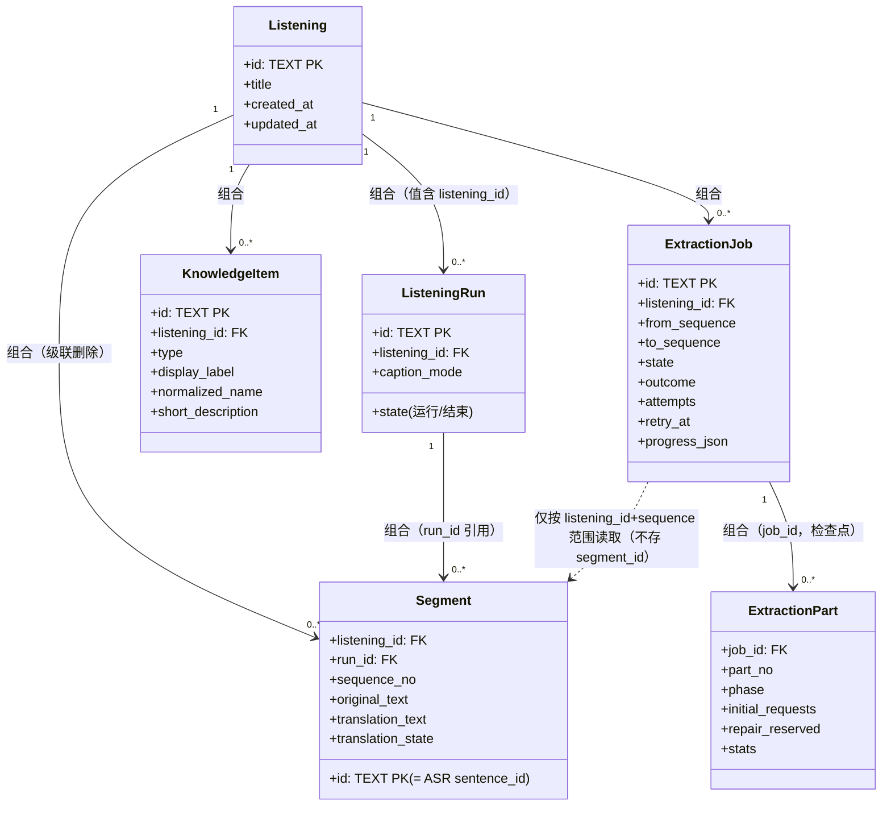
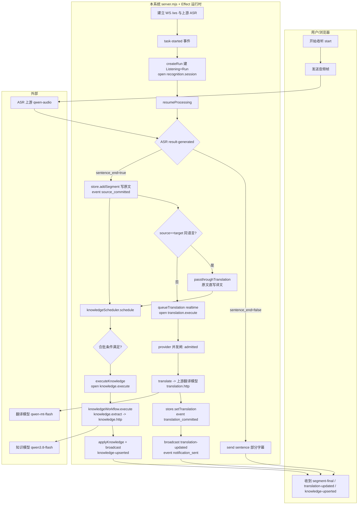
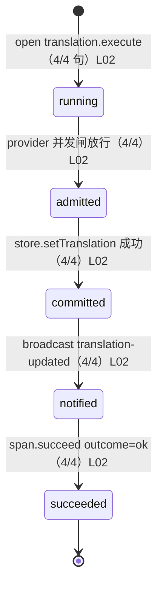
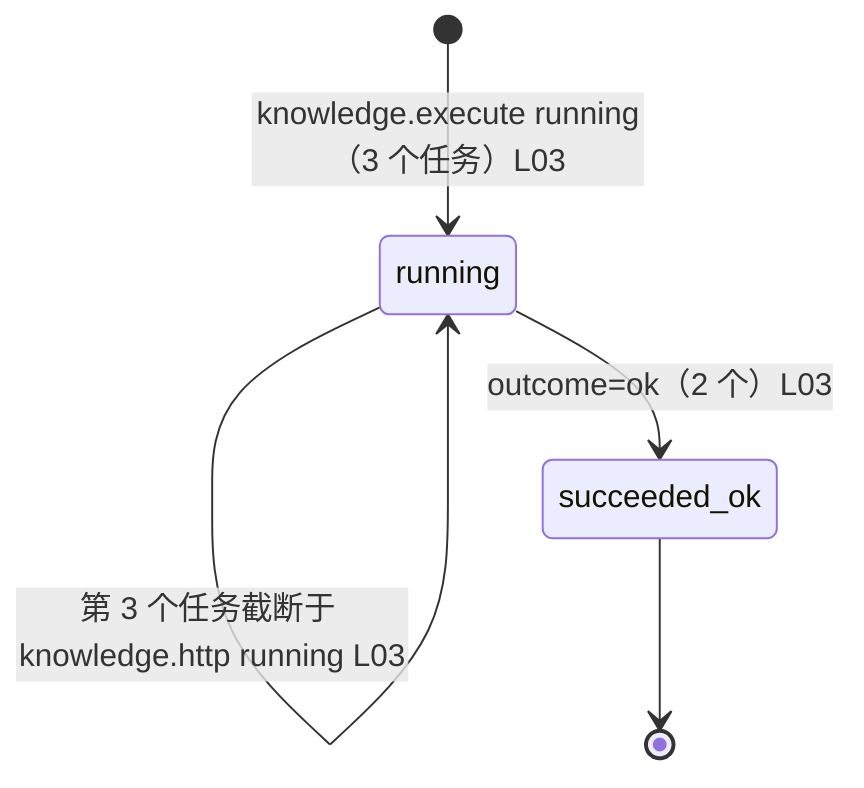

# 实时收听 → 字幕定稿 → 翻译 → 知识抽取：现状行为模型

> **范围**：入口为浏览器 `WS /ws` 的一次收听会话（`start` → ASR 上游 → 字幕定稿 → 翻译 → 知识抽取）。相关代码：`server.mjs`（组合根、`/ws` 网关、`queueTranslation`、`executeKnowledge`）、`knowledge-queue.mjs`、`knowledge-workflow.mjs`、`storage.mjs`、`src/server/**`（Effect 运行时与 `execution_trace` 采集）。**只覆盖这一条实时链路**，不含 `preview`（`/api/translate` 临时翻译）、播报（`/ws/tts`）、关系图谱（`relations*`）。
> **代码版本**：分析时仓库 HEAD = `e636cac`（工作区干净，无未提交改动）。
> **日志**：`/tmp/hearwise-real.log`，312 行 `execution_trace`（另 1 行为 `tee` 截断半行，见「完整性」），单一进程 `287899ef-3296-4cd0-b76f-8267c883ccfb`，时间窗 **2026-10-04 13:58:48.439 — 13:59:46.215（Asia/Shanghai, GMT+8）**，约 57.8s。日志内构建 `git_sha=59c4be24…`、`instrumentation_version=2`。
> **样本**：关联字段 `listening_id=397703bd-215d-46a6-9937-1d68c64de494`（收听范围，70 事件）、`run_id=5f368c48-19db-4be0-aa64-53c23488b736`（= 该 run 的 `job_id`，45 事件）。窗口内 **1 个完整收听实例、1 个 run、4 个已完成定稿句（segment）**、**3 个知识任务**。无排除实例。
> **完整性（重要，影响可断言范围）**：
> 1. **序列号连续无缺口**（5089→5399，计数 311，缺口 0），单进程单次启动，无重复导入。
> 2. **但日志两端都被截断**：起始 `sequence=5089` **不是会话第一条事件**——窗口内**没有** `listening-ready` / `recognition.session` 的 `running` 起始事件，也没有第一条 `sentence` 的部分识别事件；日志在 `sequence=5399`（第三个知识任务的 `knowledge.http` 刚发出）处**戛然而止**，**没有** `task-finished` / `recognition.session.succeeded` 之后的收尾。
> 3. **代码版本不对齐**：日志构建 sha `59c4be2` ≠ 当前 HEAD `e636cac`（本曲线间合入了 PR #50/#51/#52）。因此**日志中的观测事实对应当前代码时按「现行代码支持且日志发生」处理，但需承认版本漂移**；下文把无法用当前代码对齐的点标入「历史或旁路」附录。
> 4. 该日志由 `| tee` 落盘，首行被交叉缓冲截断（`execution_trace {"build":{`）——与 `docs/execution-trace-report.md` 所述应急补救的已知代价一致。

---

## 1. 类图

只收录本流程实际读写的对象。

| 对象 | 性质 | 读写行为 | 证据 |
| --- | --- | --- | --- |
| `Listening`（收听） | 持久化镜像 | 会话开始时经 `store.createRun` 建；本窗口只读 | C01 |
| `ListeningRun`（收听会话/run） | 持久化镜像 + **领域对象候选** | `createRun` 建，`finishRun` 结束；`job_id`==`run_id` 同值 | C01, C02 |
| `Segment`（句子/字幕片段） | 持久化镜像 + **领域对象候选** | `store.addSegment` 写原文；`store.setTranslation` 写译文（真实链路） | C01, C03 |
| `KnowledgeItem`（知识条目） | 持久化镜像 + **领域对象候选** | `store.applyKnowledge` 写；`broadcast knowledge-upserted` | C04 |
| `ExtractionJob`（抽取任务） | 持久化镜像 | 调度器创建；`markJob` 改状态/outcome | C03, C05 |
| `ExtractionPart`（抽取检查点） | 持久化镜像（技术性检查点） | 状态机 `save()` 逐阶段写 phase/stats | C05 |

> `Segment` 的 `translation.execute` 事件带 `segment_id`（= 句子 `id`），而 `ExtractionJob` 的 `knowledge.*` 事件**只有 `job_id` 与 `listening_id`，不带 `segment_id`**——知识任务与句子的关联是**按 `listening_id + sequence 范围**，不是按 segment 外键。见「聚合候选」。

---

## 2. 活动图

### 主路径

**样本与计数单位**：样本 = 窗口内唯一收听/run 下 **4 个已完成定稿句**（`6882d174`, `01a0ca50`, `261b90ff`, `8ff2df64`，按首次出现顺序）。计数单位为**句子级别**的定稿与翻译。分母 = 4（已定稿句），无排除。以下路径 4/4 句均出现，**是窗口内唯一观测路径**（但仅 1 个实例，见 §3 说明）。

**主路径证据**：句子定稿写库 C03 / `source_committed` L01；实时翻译 `translation.execute` 五态序列（`running → admitted → translation_committed → notification_sent → succeeded`）L02；知识 `knowledge.execute → knowledge.extract → knowledge.http →（成功）` L03。四句均走此路径。

### 已观测异常或补偿路径

**缺口：窗口内无失败、无重试、无恢复、无取消、无补偿日志。** 全部 `translation.*` / `knowledge.*` / `recognition.session` span 的终态均为 `succeeded`（0 个 failed/cancelled 状态；`knowledge.execute` 3 个任务中 2 个 `succeeded`，第 3 个在窗口结束时仍在 `running`，属**截断**而非失败）。按 skill 要求**不补画假路径**；第二张异常/补偿图位置如实留空。

（`translation.preview` 的 35 个 span 全部 `succeeded`，无 `discarded` 事件——本窗口未触发「最终译文优先」造成的预览丢弃分支，虽代码存在该分支 C06，属**冷路径**。）

---

## 3. 状态图

窗口内**真正有生命周期且有日志证据**的对象：**翻译任务（`translation.execute` span）** 与 **抽取任务（`ExtractionJob`）**。句子/收听的完整生命周期因日志两端截断无法闭合，故不下结论。

### 翻译任务（`translation.execute`，每句一个 job）

| 对象转移 | 次数/分母及计数单位 | 代码证据 | 日志证据 |
| --- | --- | --- | --- |
| running→admitted→committed→notified→succeeded | 4/4 句（按**尝试**计，各句均 1 次尝试） | C06 | L02（seq 5184–5196 / 5338–5354 / 5360–5372 / 5374–5388） |

> 注意：`translation.http` 的 `running/succeeded` **是子步骤 span**，不是业务对象生命周期；`admitted/translation_committed/notification_sent` 才是业务语义事件（skill §3 明确不可把 span 的 started/succeeded 当业务转移——此处业务转移由显式 `event` 支撑，方成立）。

### 抽取任务（`ExtractionJob`）

| 对象转移 | 次数/分母及计数单位 | 代码证据 | 日志证据 |
| --- | --- | --- | --- |
| running →（extract 阶段）→ succeeded(outcome=ok) | 2/3 任务（按**任务**计） | C05 | L03（job `2387767d` seq 5201–5259；job `b99b37d3` seq 5355–5394） |
| running →（仍在跑，窗口截断） | 1/3 任务 | C05 | L03（job `c16c3818` seq 5395–5399 无终态） |

> 被观测任务均 `attempt=1`、`phase=extract`、`request_count=1`、`accepted_count=1/rejected_count=0`——**未观测** `repair_pending`/`extract_pending`（重试）转移；状态机代码允许这些转移（C05），属**冷路径**附录。**不把「调用成功」写成「任务完成」**：2 个任务确为 `outcome=ok` 终态；第 3 个只有 `knowledge.http running`，是截断，**不是成功也不是失败**。

---

## 4. 事件风暴时间线

**实例**：`listening_id=397703bd…` / `run_id=5f368c48…`。关联字段完整，但**实例本身在日志窗口内不完整**（无会话起始、无收尾）；以下按日志实际出现顺序列出**已发生事实**，不含推断的命令。技术事件（span/采集）与候选领域事件分开标注。

| 顺序/并行组 | 命令/候选领域事件/技术事件 | 触发者与入口 | 业务动作或已发生事实 | 对象/候选聚合/外部系统 | 原始技术名 | 证据 |
| --- | --- | --- | --- | --- | --- | --- |
| (pre-window) | 技术事件（缺） | — | 会话已开始、部分音频已识别（窗口外） | Run | （无起始事件） | — |
| 5089–5181 | 技术事件：临时翻译预览 ×多 | 浏览器 `/api/translate` | 说话中，反复请求临时译文 | 外部：翻译模型 | `translation.preview` / `translation.http`（kind=preview） | L04 |
| 5183 | 候选领域事件：句子定稿（部分识别完成） | ASR 上游 | 第 1 句 `6882d174` 定稿出句 | Segment / Run | `recognition.session` event（segment_id=6882d174） | L05 |
| 5184–5196 | 候选领域事件：实时翻译该句 | 系统 `queueTranslation` | 第 1 句被放行→译→写→通知 | Segment；外部翻译模型 | `translation.execute`(realtime) | L02 |
| 5193 | 技术事件：翻译 HTTP 完成 | 系统 | 译文 HTTP 200（1.0s） | 外部翻译模型 | `translation.http` succeeded | L06 |
| 5201–5259 | 候选领域事件：知识抽取任务 1 | `knowledgeScheduler` | 抽取 job `2387767d`→写知识、`outcome=ok` | ExtractionJob / KnowledgeItem；外部知识模型 | `knowledge.execute`→`.extract`→`.http` | L03 |
| 5337 | 候选领域事件：句子定稿 | ASR 上游 | 第 2 句 `01a0ca50` | Segment | `recognition.session` event | L05 |
| 5338–5354 | 候选领域事件：实时翻译该句 | 系统 | 第 2 句译完（含一次 10.3s 长耗时） | Segment | `translation.execute`(realtime) | L02 |
| 5355–5394 | 候选领域事件：知识抽取任务 2 | `knowledgeScheduler` | job `b99b37d3`→`outcome=ok` | ExtractionJob | `knowledge.execute` 链路 | L03 |
| 5359–5372 | 候选领域事件：句子定稿 + 翻译 | ASR + 系统 | 第 3 句 `261b90ff` 定稿并译完 | Segment | `recognition.session` + `translation.execute` | L02,L05 |
| 5373–5388 | 候选领域事件：句子定稿 + 翻译 | ASR + 系统 | 第 4 句 `8ff2df64` 定稿并译完 | Segment | `recognition.session` + `translation.execute` | L02,L05 |
| 5378 | 技术事件：识别会话 span 成功 | 系统 | `recognition.session` succeeded（**仅此一次，语义待确认**） | Run | `recognition.session` succeeded | L07 |
| 5395–5399 | 候选领域事件：知识抽取任务 3（进行中） | `knowledgeScheduler` | job `c16c3818` 起，`knowledge.http running` 后**日志结束** | ExtractionJob | `knowledge.execute` 链路 | L03 |
| (post-window) | 技术事件（缺） | — | 会话收尾（`task-finished`？）不可知 | — | （无） | — |

**并行/偏序**：`translation.*`（浏览器→翻译）与 `knowledge.*`（调度器→知识）在时间上交错、**无共同父 span**，二者是**并行分支**，不能据时间戳拼因果（skill §2）。`provider_request` 旁路行（非 trace）显示翻译与知识共用上游 provider，含一条 `priority:knowledge 8379ms`，但**无 span 关联**，仅作旁证。

### 失败后补偿时间线

**未观测。** 窗口内无失败，故无补偿。按 skill 要求直接说明，不把任何重试/取消命名为补偿。

---

## 5. 聚合候选与待确认清单

以下均为**假说**，不能作为已确认领域设计。

| 聚合候选 | 内部对象 | 推测的不变量 | 证据强弱与反证 | 待确认业务问题 |
| --- | --- | --- | --- | --- |
| **收听（Listening）** | Listening, ListeningRun, Segment | 一次收听内的句子按 `sequence_no` 单调递增、同属一个 run | **强**：`segments` 有 `listening_id+sequence_no` 索引 C03，级联删除 C03。反证：窗口只有 1 个 run，无法验证多 run 下的边界 | 「一次收听」的业务边界是一次会话还是可含多次 run？ |
| **抽取任务（ExtractionJob）** | ExtractionJob, ExtractionPart | 一个 job 覆盖一段 `from_sequence..to_sequence`，检查点在同一 job 内推进 | **中**：同一 `job_id` 下 `execute/extract/http` 同 trace（§3）C05。反证：日志未观测重试/多 part | 任务与句子的业务边界是按序列区间还是按会话？ |
| **句子（Segment）** | Segment | 定稿原文写入后译文迟到补齐，`translation_state` 表达进度 | **中**：`setTranslation` 代码路径 C03；事件 `translation_committed` L02。反证：窗口未见 `translation_state` 字段值流转的日志 | 句子是聚合根还是仅 Run 的从属记录？ |

**待确认清单（代码与日志都无法回答的业务含义）**：
1. `recognition.session` 的 `succeeded`（seq 5378）出现在**最后一句定稿之后、第 3 个知识任务之前**——它的业务含义是「识别会话结束」还是「某段处理完成」？当前代码在 `task-finished` 才 `recognitionTrace?.succeed()` C02，但日志窗口**无 `task-finished` 事件**，二者不吻合（见附录「历史或旁路」）。
2. 一次收听中若产生**多个** `ExtractionJob`，其业务边界（按时间窗合批 vs 按会话收尾）为何？

---

## 附录：证据账本与名称对照

| ID | 候选业务名 | 原始技术名 | 来源 | 关联字段 | 证据类别 |
| --- | --- | --- | --- | --- | --- |
| C01 | 收听/会话建立 | `store.createRun`（server.mjs:602）、`createRun` | commit `e636cac` server.mjs:602 | listening_id, run_id | 代码 |
| C02 | 识别会话 span | `recognitionTrace = taskRuntime.open('recognition.session', …)`；`recognitionTrace?.succeed()` on `task-finished` | server.mjs:603, 649–650 | run_id, listening_id | 代码 |
| C03 | 句子写库/译文写库 | `store.addSegment`（server.mjs:618）、`store.setTranslation`（server.mjs:272/279/322）；schema `segments` | server.mjs:618, 272; storage.mjs:38 | segment_id, listening_id | 代码 |
| C04 | 知识写库与广播 | `store.applyKnowledge` + `broadcast knowledge-upserted` | server.mjs:313–314 | listening_id | 代码 |
| C05 | 抽取状态机与检查点 | `knowledge-workflow.mjs execute()` 阶段 extract_pending/inflight、repair_pending/inflight、done；`save()` 写 extraction_parts | knowledge-workflow.mjs:181–276, 23 | job_id | 代码 |
| C06 | 实时翻译调度与并发闸 | `queueTranslation`、`translation.execute` open、provider `priority` 闸、`translation-updated` 广播 | server.mjs:250–298, 358–392 | job_id, segment_id, run_id, kind | 代码 |
| C07 | 知识合批/调度默认值 | `KNOWLEDGE_DEFAULTS`（minStartIntervalMs 2000 / translationGraceMs 1500 / concurrency 2） | knowledge-queue.mjs:3–5 | listening_id | 代码 |
| L01 | 句子定稿入库 | `recognition.session` event `source_committed` | /tmp/hearwise-real.log seq 5183/5337/5359/5373（recognition.session `event`） | listening_id, run_id, segment_id | 日志（已观测） |
| L02 | 实时翻译五态 | `translation.execute` running/admitted/translation_committed/notification_sent/succeeded | 同日志 seq 5184–5196, 5338–5354, 5360–5372, 5374–5388 | segment_id, run_id, job_id | 日志（已观测） |
| L03 | 知识抽取链路 | `knowledge.execute`→`knowledge.extract`→`knowledge.http`，`outcome=ok` | 同日志 seq 5201–5259, 5355–5394, 5395–5399 | job_id, listening_id | 日志（已观测） |
| L04 | 临时翻译预览 | `translation.preview`（kind=preview） | 同日志 seq 5089–5181 等（35 个 job） | job_id | 日志（已观测） |
| L05 | 句子定稿出句 | `recognition.session` event（带 segment_id，无 event 名） | 同日志 seq 5183, 5337, 5359, 5373 | segment_id, run_id | 日志（已观测） |
| L06 | 翻译 HTTP 完成 | `translation.http` event response_received/headers/provider_started + succeeded | 同日志 seq 5090…5385 | segment_id/job_id | 日志（已观测） |
| L07 | 识别会话 span 成功 | `recognition.session` succeeded | 同日志 seq 5378 | run_id, listening_id | 日志（已观测，语义待确认） |

---

## 附录：冷路径

现行代码支持、但**本日志窗口内未观测**（**不得描述为已发生**）：

- **同语言直通** `passthroughTranslation`（server.mjs:317–327）：来源=目标语言时原文直写译文、不进翻译队列（含 `admitted`→`translation_committed` 两事件）。窗口内 4 句均走真实翻译，未触发 C06。
- **临时翻译丢弃/429**（server.mjs:370–375，`FINAL_TRANSLATION_BUSY`）：`translation.preview` 全部 `succeeded`，未观测 `discarded` C06/L04。
- **ASR 断句参数回退重连**（server.mjs:640–645，`asr_param_fallback`）：未观测 C02。
- **定稿冲突纠正**（server.mjs:621–624，`asr_final_conflict` + `caption-correction` + `speech.correct`）：未观测 C02。
- **知识重试/纠正阶段** `extract_pending`/`repair_*`（knowledge-workflow.mjs:181–276）：3 个任务均 `attempt=1`、`phase=extract`、无 repair C05/L03。
- **抽取失败/取消终态**：无。
- **`/ws/tts` 播报链路**、**`relations*` 图谱链路**：本窗口无相关 span（不在本报告范围）。

---

## 附录：历史或旁路

日志发生、但**与现行代码无法干净对齐**（版本漂移或语义不匹配）：

- **版本漂移**：日志 `git_sha=59c4be24…`（PR #49 后、PR #50–52 前），当前 HEAD `e636cac`。本报告 §1–§5 引用的**代码行号以当前 HEAD 为准**；若 `59c4be2` 与 `e636cac` 之间上述文件有改动，则部分「行号级」证据存在时差。合入的 PR #50/#51/#52 未触及本链路核心（business trace / transcript 可见性 / skill 文档），故判定为**低风险漂移**，但不等于零。
- **`recognition.session.succeeded` 语义不匹配**：现行代码 C02 仅在 `task-finished` 时 `recognitionTrace?.succeed()`。日志 seq 5378 出现 succeeded，但窗口内**没有任何 `task-finished` 对应事件**，且其后仍有知识任务在跑。可能原因：①`task-finished` 不在 trace span 集合内被采集；②`succeeded` 由其它路径触发。**无法用现有证据对齐，标为旁路/待核。**
- **首行截断**：`/tmp/hearwise-real.log` 首行为 `execution_trace {"build":{`（`tee` 交叉缓冲截断），与 `docs/execution-trace-report.md` 记录的应急补救代价一致；不影响其余 311 条已解析事件。

---

*报告生成时间：2026-10-04（Asia/Shanghai）。本报告为只读现状分析，未修改任何代码、未运行生产任务、未调用付费模型。*
