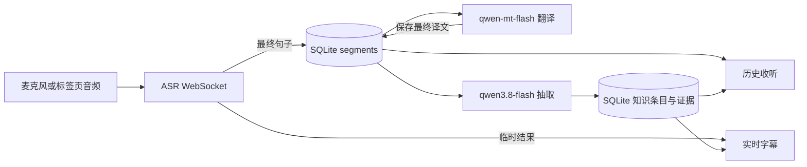

# 收听历史与知识抽取实现方案

> 状态：已实现。适用范围：当前运行在本机 `127.0.0.1` 的单用户 Web 应用。

## 1. 目标与已确认的行为

1. 增加「新建收听」和「历史收听」。新建收听产生一条独立记录；选择历史收听后可以查看已有内容，并在同一条记录下继续收听、追加内容。
2. 用 SQLite 保存每句最终识别原文、最终译文、发生时间和所属收听记录。识别过程中的临时字幕可以实时显示，但不写入历史。
3. 收听过程中，`qwen3.8-flash` 根据最终识别原文抽取人物、术语、事件及其他有用知识。抽取与翻译并行，知识任务不得阻塞字幕和译文。
4. 知识在当前收听记录内去重。模型可以修正知识条目的名称、别名和解释；已保存的识别原文与译文保持原样。
5. 知识条目包含简要解释。模型可以补充通用背景知识，但界面与数据库必须区分「对话中提到的内容」和「模型补充的背景」。无法确定的名称或背景标记为「待确认」，不作为对话事实呈现。
6. 知识在收听页随抽取结果更新，在历史页可再次查看。「实时」指收听期间持续更新；展示速度取决于断句、批量触发和模型响应，不承诺逐词即时出现。

当前应用仅在浏览器内存中显示最新一句字幕，API Key 保存在浏览器 `localStorage`，服务端没有数据库。新增历史后仍不保存音频和 API Key；SQLite 保存的是文本、模型处理状态与知识。自动命名建议采用创建时的本地日期时间，避免新建操作增加输入步骤。

## 2. 页面流程

### 新建收听

1. 点击「新建收听」进入空白收听页，沿用当前默认值：识别英语，翻译成简体中文，声音来源可选麦克风或浏览器标签页。
2. 点击「开始收听」。麦克风授权或标签页共享完成，且 ASR 返回 `task-started` 后，服务端创建收听记录和第一次收听片段，并返回 ID。授权取消、Key 无效或任务启动失败时不生成空历史。
3. 页面继续显示大字实时译文、原文和持续更新的知识列表。最终原文先写入 SQLite；翻译和知识抽取在后台分别完成并更新页面。
4. 停止收听后，该片段结束；已保存的原文、译文和知识保留。尚未完成的模型任务继续处理；失败的任务显示状态并允许重试。

### 历史收听与继续收听

1. 点击「历史收听」打开按最近更新时间倒序排列的列表。每项显示标题、最后收听时间、已保存句数和知识条目数。
2. 选择一项后读取完整原文、译文、知识及各次收听片段。点击「继续收听」会在原记录下创建新的收听片段，不覆盖过去的句子，也不尝试复用已结束的 ASR WebSocket 任务。
3. 新片段默认沿用上一片段的识别语言、目标语言与声音来源；开始前仍可调整。每句保存其所属片段，因此之后改变语言设置不会改变旧译文。
4. 同一收听记录同一时间只允许一个正在进行的片段。另一个页面尝试继续时，服务端返回明确的占用错误，避免交叉写入。

## 3. 数据模型

SQLite 文件建议放在 `data/listenings.sqlite`，`data/` 不纳入版本控制。启动时执行版本化迁移，并开启外键约束和 WAL。所有时间写入 UTC 时间戳，界面再按本地时区显示。

| 表 | 核心字段 | 用途与约束 |
| --- | --- | --- |
| `listenings` | `id`, `title`, `created_at`, `updated_at` | 一条可多次继续的历史收听。 |
| `listening_runs` | `id`, `listening_id`, `run_no`, `audio_source`, `source_lang`, `target_lang`, `started_at`, `ended_at`, `state` | 每次「开始／继续收听」对应一行；同一记录内 `run_no` 唯一。异常退出记为 `interrupted`。 |
| `segments` | `id`, `listening_id`, `run_id`, `sequence_no`, `asr_sentence_id`, `original_text`, `translation_text`, `translation_state`, `begin_ms`, `end_ms`, `created_at` | 只保存 `sentence_end=true` 的结果；`(run_id, asr_sentence_id)` 防止重复事件，`(listening_id, sequence_no)` 保证跨片段顺序。译文可稍后填入。 |
| `knowledge_items` | `id`, `listening_id`, `type`, `canonical_name`, `normalized_name`, `dialogue_summary`, `background_note`, `certainty`, `created_at`, `updated_at` | `type` 至少含人物、术语、事件、其他。为 `(listening_id, type, normalized_name)` 建索引，但不设唯一约束，以容纳同名不同实体；背景与对话摘要分别存储。 |
| `knowledge_aliases` | `item_id`, `alias`, `normalized_alias` | 保存识别误写、译名和简称；同一条收听内用于候选匹配。 |
| `knowledge_mentions` | `item_id`, `segment_id`, `surface_text` | 知识条目与原文句子的证据关系；一条知识可以对应多句。 |
| `knowledge_revisions` | `item_id`, `action`, `old_value`, `new_value`, `merged_from_id`, `reason`, `created_at` | 记录自动纠错或合并，便于追溯，不改写 `segments`。 |
| `extraction_jobs` | `id`, `listening_id`, `from_sequence`, `to_sequence`, `prompt_version`, `state`, `attempts`, `last_error`, `created_at`, `updated_at` | 持久化抽取范围、提示词版本与处理状态；同一范围唯一，重启后可识别未完成工作。 |

`translation_state` 使用 `pending`、`complete`、`failed`；抽取任务使用 `pending`、`running`、`complete`、`failed`。数据库约束、事务和服务端校验共同保证每个最终句子只写入一次。历史查询按 `sequence_no` 排序，不依赖模型响应到达顺序。

## 4. 服务端处理流程

### 识别与翻译

- 在现有 WebSocket `start` 消息中保留识别语言 `source`，增加 `listeningId`（新建时为空）、`targetLang`、`audioSource`。`task-started` 后创建或续接收听记录，并向浏览器回传 `listeningId`、`runId`；数据库创建失败时关闭本次识别任务并明确报错。
- ASR 的临时结果仍直接推送页面。最终结果先按 `runId + sentence_id` 幂等写入 `segments`，再推送页面，并安排最终翻译与抽取。服务端继续用现有 `qwen-mt-flash` 接口翻译最终句子，将结果写入同一行；临时译文可以保留现有节流机制，但不写入 SQLite。
- 翻译失败时保留原文与 `failed` 状态。重试只针对尚无最终译文的句子，不能产生第二条原文。翻译和抽取分别运行，任一失败不阻断另一个。

### 实时优先级与请求调度

- 优先级为音频转发与 ASR 事件、最终句子翻译、临时字幕翻译、知识抽取。音频转发和 ASR 消息处理不等待翻译、抽取或整批数据库处理；最终原文只做短事务写入，之后把模型任务交给异步队列。
- 当前前端会取消过时的临时翻译请求。改造后保留此行为，但最终句子翻译必须按句独立入队并持久化状态，不能因后续句子到达而取消或丢弃。临时翻译只处理最新内容，不积压历史请求。
- 知识抽取使用独立低优先级队列。单用户版本先限制为全局最多 1 个在途 `qwen3.8-flash` 请求；按小批次提交，有待处理的最终译文时暂缓启动下一批抽取。持续讲话导致没有空闲窗口时，达到可配置的最长等待时间仍启动一批，避免知识一直得不到处理。已发出的抽取请求不阻塞新翻译请求，抽取超时或失败只影响知识状态。
- 限制抽取任务的在途数量和单次输入体积；积压时合并相邻、尚未发出的批次，但不跳过原文句子。SQLite 写事务保持短小；JSON 解析、去重计算和云端等待都不放在事务内。若运行中观察到事件循环卡顿，再考虑把较重的知识处理移到 Worker，初版无需增加进程或消息队列。
- 记录 ASR 最终句到译文显示的耗时、抽取排队长度和模型限流／超时次数。若同一 API Key 的云端配额使两个模型请求互相排队，进一步收紧抽取并发或只在翻译空闲窗口启动，而不是降低翻译频率。

### 知识抽取、去重与纠错

- 抽取只消费已完成的原文句子，不等待译文。将相邻最终句子组成小批次，附带少量前文和当前收听记录的相关知识候选；间隔触发、停止收听和达到批次大小时都可提交。初始触发值建议为 3 句或约 10 秒，作为可调整参数，不作为产品时延承诺。
- 使用现有 `https://maas.qianwenaiapi.com/compatible-mode/v1/chat/completions`，模型设为 `qwen3.8-flash`，并以 `enable_thinking: false` 关闭思考模式。固定 System Message 与动态 User Message、JSON 对象格式和字段约束见[知识抽取提示词 v1](knowledge-extraction-prompt.md)。输入包含片段 ID；输出要求提供原文子串和片段 ID，使模型结论可追溯。
- 服务端剥离可能出现的 Markdown 代码围栏，再解析并校验 JSON。单条目独立挽救：证据 ID 不存在的条目丢弃并记日志，过长字段截断，不在当前收听记录中的知识 ID 拒绝关联并降级为新建。模型输出不直接作为 SQL 或 HTML 使用。
- 先按类型、规范化名称和别名做确定性匹配；再把少量可能重复的旧条目交给模型判断是否同一对象。只有证据足够明确时自动合并或纠正名称；不确定时保留独立条目并标记「待确认」。纠正记录写入 `knowledge_revisions`，原文与译文不变。
- 把对话中能直接找到的描述写入 `dialogue_summary`，把模型补充的常识写入 `background_note`。通用背景来自模型已有知识，不能当作已外部核实的事实；界面明确标注「背景补充」。
- 同一收听记录的抽取任务按 `sequence_no` 顺序执行，避免并发任务互相覆盖去重结果；它与翻译请求并行。批次大小需留出提示词、前文和旧条目的空间，控制单批输入体积。[千问文本生成官方文档](https://platform.qianwenai.com/docs/developer-guides/text-generation)

### 任务恢复与 API Key

ASR 最终原文一经写入就不依赖后续模型成功。模型任务状态保存在 SQLite；服务重启时把中断的 `running` 任务恢复为待处理。当前设计不把 API Key 写入 SQLite，所以进程重启后无法自行重试云端任务；用户再次打开该收听记录，点击「继续处理」并提供浏览器中保存的 Key 后，后台重试。停止收听但服务仍运行时，内存中的 Key 可供已排队任务完成。Key 只在请求处理期间驻留服务端内存。

## 5. 接口与前端改造

| 接口或事件 | 用途 |
| --- | --- |
| `GET /api/listenings` | 分页列出历史收听摘要。 |
| `GET /api/listenings/:id` | 返回收听信息、片段和知识概览；句子通过分页参数逐页获取。 |
| `POST /api/listenings/:id/retry` | 在浏览器提供 Key 后，重试该记录中失败或中断的翻译与抽取任务。 |
| `GET /api/listenings/:id/export?kind=original\|translation` | 把该记录全部句子的原文或已完成译文按顺序合并为 txt 附件下载，不受句子分页限制。 |
| `GET /api/listenings/:id/segments` | 范围查询最终句：`runId` 限定片段（服务端校验归属）、`latest=N`（1-200）、`afterSequence=N`+`limit`、`beforeSequence=N`+`limit`（limit 1-200，默认 50）、`ids=`（1-50 个 UUID）。返回按 `sequence_no` 升序的 `items`、范围内 `total` 与 `pending` 数，用于实时时间线恢复与停止后定点补齐。 |
| WebSocket `start` | 携带新建／继续所需的 ID 和语言设置；`captionMode` 取 `realtime`（默认，向 ASR 下发低延迟断句参数，被拒时显式回退旧参数重连一次）或 `classic`（不带断句参数）。 |
| WebSocket `listening-ready` | 回传已创建的收听 ID、片段 ID 与本次生效的 `captionMode`。 |
| WebSocket `segment-final`、`translation-updated`、`knowledge-upserted` | 推送各阶段独立完成的结果；每个事件携带稳定 ID，前端按 ID 更新。`sentence`、`segment-final`、`translation-updated` 均带 `runId`，供前端丢弃过期连接的迟到事件。 |

翻译调度（`translation-queue.mjs`）：实时最终句与后台补齐共享总并发 2。活跃 run 最近 2 个待译最终句优先并按源序启动，其余最终句与历史重试按 FIFO；连续派发 3 个实时任务后，若最老后台任务已等待 ≥10 秒，下一槽位让给它防饥饿。内存任务清单上限 500，超限丢弃最老后台任务（SQLite pending 状态与「继续处理」可完整恢复）。旧的临时翻译接口 `/api/translate` 并入同一额度，忙时返回 429。

收听页增加「新建收听」「历史收听」入口和可收起的知识区域，大字幕区域保持主要位置。历史页显示所有片段与知识，提供「继续收听」；若有失败或中断的模型任务，提供「继续处理」。收听进行中通过 WebSocket 更新；停止后若仍有后台任务，可短时轮询详情接口直到任务完成，以免 ASR WebSocket 关闭后遗漏知识更新。新增写入接口需要校验同源请求；若未来开放到局域网或公网，必须先补身份验证和历史数据隔离。

设置里的「测试连接」增加 `qwen3.8-flash` 检查，并单独显示识别、翻译、知识抽取三项结果。测试文本要尽量短，同时提示可能产生少量模型费用。

## 6. 代码落点与实施顺序

1. 增加 SQLite 存储模块、迁移脚本和 `data/` 忽略规则；实现收听、片段与知识的读写接口。当前机器运行 Node.js 24.13.0，建议采用内置 `node:sqlite`，并把 README 的最低版本从 Node.js 20 调整为 Node.js 24；`node:sqlite` 在该版本仍标为实验性。已验证当前环境可创建内存数据库，落地时还需验证磁盘数据库、WAL 与迁移。[Node.js 24.13.0 SQLite 文档](https://nodejs.org/download/release/v24.13.0/docs/api/sqlite.html)
2. 改造 `server.mjs` 的 ASR 事件处理：创建／续接片段，保存最终原文，异步翻译并持久化，提供历史接口。浏览器仍显示临时字幕，但最终结果以服务端存储的版本为准。
3. 增加 `qwen3.8-flash` 抽取队列、输出校验、同记录去重、纠错记录与失败重试。模型返回可能包含代码围栏，解析前需清理并校验。[千问文本生成官方文档](https://platform.qianwenai.com/docs/developer-guides/text-generation)
4. 调整 `public/index.html`、`public/app.js`、`public/style.css`，实现新建、历史、继续收听、知识实时显示和处理状态；保留现有麦克风／标签页声音选择。
5. 验证数据库迁移、断线重连、服务重启、重复 ASR 事件、翻译失败、抽取失败、同名不同实体、跨片段别名、继续收听追加顺序和无 Key 恢复提示。

## 7. 验收条件

- 新建收听成功后，刷新页面能在历史列表中看到此前最终原文和译文；临时识别文本不进入历史。
- 从历史继续收听产生新的片段，旧句子不变，新句子按发生顺序追加；重复的最终 ASR 事件不会产生重复句子。
- `qwen3.8-flash` 处理期间，识别与翻译仍可更新。人物、术语和事件在收听页出现，刷新后仍能在同一条历史收听中看到。
- 人为让知识抽取延迟或失败时，音频转发与最终句子翻译仍继续；积压的知识任务随后补齐，不丢句。连续新句子到达时，已保存的最终原文不会因临时译文取消而失去最终译文。
- 同一收听内的别名和确认的误写合并到对应知识条目，修正前后名称可追溯；原文、译文保持原值。
- 知识条目的对话摘要可定位到原文句子，模型背景补充有独立标识；证据不足的条目显示「待确认」。
- 任一模型调用失败时，已保存的其他结果不丢失，页面显示失败状态，重新提供 Key 后可重试。
- SQLite 中没有 API Key 或原始音频文件。

## 8. 范围与限制

本方案按本机单用户使用设计。知识只在同一条历史收听内去重；不同收听之间允许出现同名条目。当前不包含账号同步、多人协作、音频回放、自动从外部网站核实背景知识或自动修改字幕。通用背景由模型生成，存在错误可能；界面必须保留来源区别与「待确认」状态。
